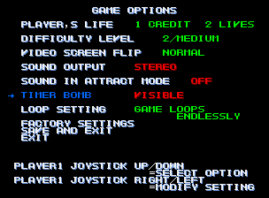
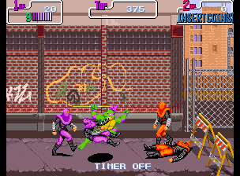
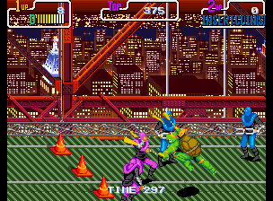
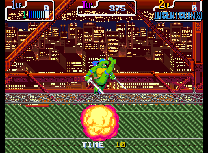

# Turtles in Time (Arcade) - Visible Timer Bomb Patcher

## Disclaimer

This project only provides a client-side tool to apply patches. It does not distribute, host, or include any copyrighted ROM data. Teenage Mutant Ninja Turtles: Turtles in Time and all related characters, artwork, and game assets are property of Konami. Users are responsible for providing their own legally obtained ROM files. This project is licensed under the MIT License; that license applies solely to the source code of this tool and does not extend to the original game or its assets.

## What is the Timer Bomb?

If you stay on the same level for 5 minutes (300 seconds) without losing a life, an almost impossible-to-dodge bomb falls from above and makes you lose an entire life.

## Purpose

The purpose of this patcher is to give you control over the infamous timer bomb. With this patch you can now know the remaining seconds until the next bomb, train to dodge it, or even switch it off entirely and play without that pressure.

## Compatibility

The patcher is designed to work with the sets `tmht22pe` (2P, ver. EBA - Europe) and `tmnt22pu` (2P, ver. UDA - USA). Only the program ROM files `.08e`, `.08g`, `.10e` and `.10g` are required.

It is also compatible with original hardware: patch those files and burn them onto their corresponding EPROMs.

## How to Patch Your ROMs

Since this repository does not include any copyrighted ROM data, you must provide your own legally obtained `.08e`, `.08g`, `.10e` and `.10g` files (from the `tmht22pe` or `tmnt22pu` sets). Simply open the [patcher web page](https://enkorsan.github.io/TurtlesInTime-VisibleTimer/), upload the files, and the tool will validate, patch, and let you download the resulting files — all directly in your browser. No files are uploaded to any server; the entire process runs locally on your device.

## Enabling Timer Options

If this is your first time accessing the Test Menu after patching, it is recommended to apply the default options before making any other changes.

To set up the Timer Bomb, access the Test Menu and cycle through the different options (ON, OFF, VISIBLE, TRAINING).

## Timer Bomb Options

### ON

The original arcade mode. The bomb falls on you after 5 minutes without losing a life.

### OFF

The timer bomb is switched off entirely. You can play without the pressure of time and improve your technique without rushing. A text ("TIMER OFF") is printed on screen as a reminder.

### VISIBLE

The timer is active just like in the original arcade mode (you have 5 minutes to clear the level without losing a life), but in this mode the remaining seconds are printed on screen, like in other beat 'em up games. This way you always know exactly when the bomb will fall.

### TRAINING

The timer is active, but a bomb falls every 10 seconds. This mode is designed to help you train how to dodge the bomb — with practice, it becomes easy. When the timer reaches 0, you'll see the bomb falling at the top of the screen. At that precise moment, press both the attack and jump buttons together (without any direction) to perform a vertical attack. With the right timing, the bomb won't touch you and you'll dodge it successfully.

---

**[Try it here](https://enkorsan.github.io/TurtlesInTime-VisibleTimer/)**
